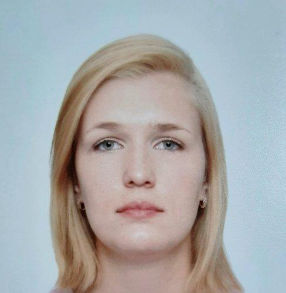

# Привет! Я QA Engineer / Начинающий QA Automation (Python) 🚀

Меня зовут **Екатерина Минец**. Более 5 лет я работаю в ИТ-поддержке и обеспечении качества сложных систем. Имея сильную базу в ручном и техническом тестировании, сейчас я активно учусь и перехожу в автоматизацию тестирования на Python.

## 📚 Обо мне и образовании
Я окончила факультет **ПММ ВГУ** (Прикладная математика, информатика и механика). Математическое образование дало мне системное мышление. В работе я не просто фиксирую поверхностные баги, а стараюсь докопаться до первопричины в логах, базах данных или коде.

## 🛠 Мой технический стек и инструменты
* **Автоматизация (в процессе освоения):** Python, фреймворк Pytest, библиотека Selenium WebDriver
* **Базы данных:** PostgreSQL (написание базовых и сложных запросов DML/DDL), Oracle, MongoDB
* **API и интеграции:** Postman, Apache Kafka (мониторинг очередей и топиков)
* **Инструменты и инфраструктура:** Git, GitHub, базовые навыки работы с Kubernetes (K8s) и Docker
* **Работа с логами и мониторинг:** Kibana, OpenSearch, Grafana
* **Таск-трекеры:** Jira Service Desk, Yandex Tracker

---
## 💻 Мой учебный проект по автоматизации
В рамках обучения я пишу учебный E2E-проект, где практикуюсь применять паттерн Page Object Model (POM), настраивать динамические ожидания WebDriverWait и автоматическое создание скриншотов при падении тестов:
🔗 [Посмотреть проект на GitHub](https://github.com)

> «Дорогу осилит идущий!» — мой девиз в обучении.

---
## 📸 Фото профиля

---
## 📇 Контакты
* **Email:** kata1-9-9-7@mail.ru
* **Локация:** г. Воронеж
